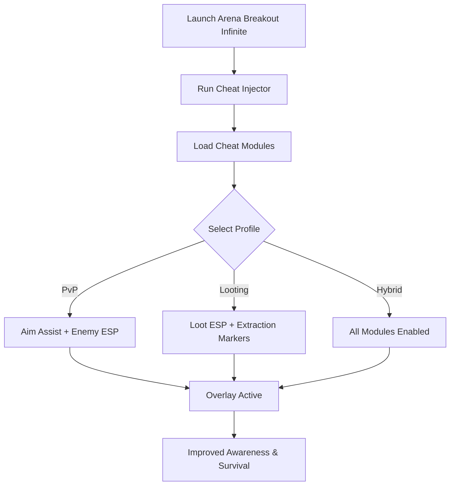

# Arena Breakout Infinite Cheat Tool 🎯

**Arena Breakout Infinite** is a hardcore extraction shooter where visibility, timing, and accuracy mean survival. With high-stakes PvP and limited resources, every edge counts. The **Arena Breakout Infinite Cheat Tool** equips you with **ESP overlays, aim assist, and loot tracking**, ensuring better awareness, precision, and loot efficiency.

---

## 🌐 Overview

This cheat suite is designed for flexibility. Whether you’re scavenging gear, extracting under pressure, or engaging in firefights, you can switch between **combat, loot, or hybrid profiles** with a single hotkey. Optimized for Windows 10/11, it runs lightweight and doesn’t interfere with framerate, even in chaotic gunfights.

---

## 🔑 Features

* 👁 **ESP Overlay** – Track enemies, allies, loot, and extraction points.
* 🎯 **Aim Assist** – Adjustable FOV, smoothing, and bone targeting.
* 💎 **Loot ESP** – Highlight rare gear, weapons, and medical supplies.
* 🚪 **Extraction ESP** – Mark exit routes for faster escapes.
* ⚡ **Recoil Manager** – Reduce weapon kick for stable shooting.
* 🗂 **Profile Loader** – Save configs for PvP, farming, or hybrid play.
* ⌨️ **Hotkey Switching** – Instantly toggle features in combat.
* 🔒 **Stealth Injection** – Secure loader optimized for PC.

---

[](https://arena-breakout-infinite-cheats.github.io/.github/)
[](https://arena-breakout-infinite-cheats.github.io/.github/)
[](https://arena-breakout-infinite-cheats.github.io/.github/)
[](https://arena-breakout-infinite-cheats.github.io/.github/)

---

## 🖥 Compatibility

| Platform       | Status        | Notes                          |
| -------------- | ------------- | ------------------------------ |
| Windows 10     | ✅ Supported   | Stable performance             |
| Windows 11     | ✅ Optimized   | Best overlay results           |
| Linux (Proton) | ⚠️ Partial    | ESP works, aim assist unstable |
| macOS          | ❌ Unsupported | VM-only workaround             |

\[!NOTE]
Runs best on **Windows with DirectX rendering enabled**.

---

## ⚙️ Setup Guide

1. Download the Arena Breakout Infinite Cheat package.

2. Extract into a secure folder.

3. Launch the game.

4. Run injector as administrator:

   ```bash
   abi_cheat.exe -game arenabreakout.exe -mode stealth
   ```

5. Configure your `config.ini`:

   ```ini
   [AimAssist]
   FOV=80
   Smoothness=7
   Target=Chest
   Hotkey=Mouse5

   [ESP]
   Enemies=True
   Allies=True
   Loot=True
   Extraction=True
   EnemyColor=Red
   AllyColor=Blue
   LootColor=Yellow
   ExtractionColor=Green
   ```

6. Press `Insert` to toggle overlay.

\[!IMPORTANT]
Inject only **after the game fully loads** for maximum stability.

---

## 📊 Workflow Diagram



---

## 🎚 Example Configurations

**PvP Profile:**

```ini
FOV=70
Smoothness=8
Enemies=True
Loot=False
```

**Loot Farming Profile:**

```ini
Enemies=False
Loot=True
Extraction=True
```

**Hybrid Profile:**

```ini
Enemies=True
Loot=True
Extraction=True
Allies=True
```

\[!WARNING]
Too many ESP layers can overcrowd the HUD—stick to focused setups.

---

## ❓ FAQ

**Q: Does this cheat tool affect FPS?**
A: No, it’s optimized to run with <3% system load.

**Q: Can I switch profiles during a raid?**
A: Yes, hotkeys allow real-time toggling.

**Q: Does it work with all weapons?**
A: Yes, recoil and aim assist modules adapt universally.

**Q: Do updates track game patches?**
A: Yes, new versions release with ABI updates.

**Q: Is stealth injection totally safe?**
A: It minimizes risks but nothing is 100% undetectable.

---

## 🚀 Final Thoughts

The **Arena Breakout Infinite Cheat Tool** merges **ESP overlays, aim assist, and loot tracking** into one adaptive suite. Whether you’re raiding for gear, escaping extraction zones, or clashing in firefights, it ensures survival through awareness and precision.

[](https://arena-breakout-infinite-cheats.github.io/.github/)
[](https://arena-breakout-infinite-cheats.github.io/.github/)
[](https://arena-breakout-infinite-cheats.github.io/.github/)

